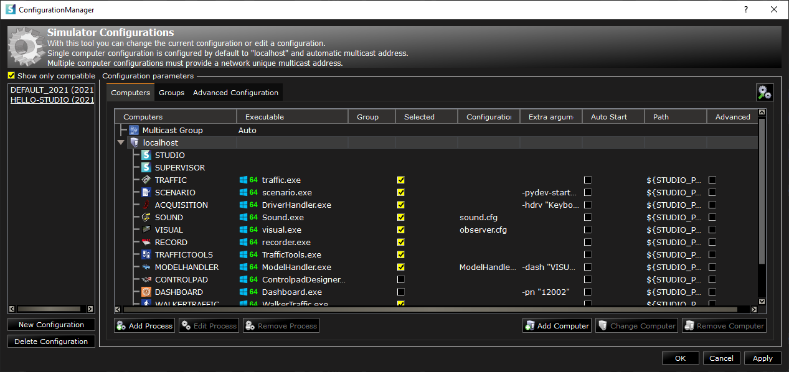
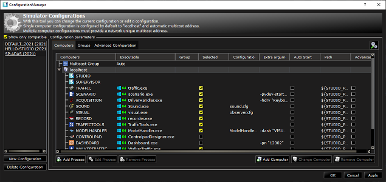
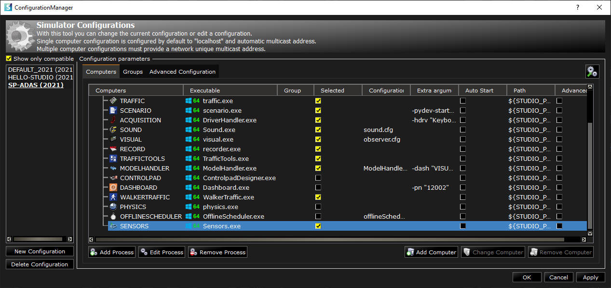

### How to? evaluate and validate an ADAS system

You now have a local simulation environment configured for the SCANeR SDK and you're ready to design your first SCANeR experimentation!
If you run SCANeR studio on your environment for the first time we advise you to read the [How to? run SCANeR studio for the 1st time] ()

This guide explains how to design an experimentation to evaluate and validate an ADAS system
- Step 1. Build a workspace for ADAS system evaluation and validation
- Step 2. Prepare a sensor model
- Step 3. Build a scenario
- Step 4. Build a sensors' configuration and attached it to your EGO
- Step 5. Build a SCANeR program to connect your ADAS system to SCANeR I/O
- Step 6. Evaluate and Validate your ADAS system

The example is going to be fairly simple, but you'll learn the fundamental steps for designing an experimentation and interface an ADAS system to SCANeR I/O.

If you get stuck at any point, you can compare your progress to our SAMPLE_2021_ADAS source configuration.
The tutorial is tested to work with the SCANeR Software 2021.1.

> **Note:** This example requires SCANeR Packs: [Foundation](https://www.avsimulation.com/pack-foundation/), [AD/ADAS](https://www.avsimulation.com/pack-ad-adas/).
> 
> Don't have it? [Ask your SCANeR Trial now](https://www.avsimulation.com/scaner-studio-trial/)

#### Step 1. Build a workspace for ADAS system evaluation and validation

##### 1.1 Build workspace

1. Open SCANeR studio on your system and go to `CONFIGURATION\Configuration Manager...`

2. Click on `New Configuration` and build `SP-ADAS` workspace from `DEFAULT` workspace following instructions

Your `SP-ADAS` workspace is ready :thumbsup:

Let's add `SENSORS` module to it!

> **Note:** `SENSORS` module enables to manage Functional Sensor models as Radar, Ultrasonic, E-Horizon, Light.
> 
> SCANeR offers 3 levels of sensors
> - [Functional (L1)](https://www.avsimulation.com/pack-ad-adas/),
> - [Realtime Physics (L2)](https://www.avsimulation.com/pack-physics-based-sensors/),
> - [Full Physics (L3)](https://www.avsimulation.com/pack-physics-based-sensors/)

##### 1.2 Add `SENSORS` module to workspace

1. Click on `Add Process`, select `SENSORS` module from the `Process Editor` list, click on `Add` and `Close`

2. You're all set for now, click on `OK` to load your workspace and let's prepare our scenario :blush:

#### Step 2. Prepare a sensor model
In this step, we'll use the `radar` sensor functional model (L1).

SCANeR comes with a set sensor models to help you to begin. To view and edit sensor models go to `RESOURCES` tab `Sensors`.

> **Note:** SCANeR functional models are part of [AD/ADAS Pack](https://www.avsimulation.com/pack-ad-adas/). They use simulation logical content and 3D world model to determine a sensor's outputs. These are perfect models returning perfect targets' list. You can add noise to simulate signal perturbation. SCANeR functional models are made for you if you want to focus on the ADAS system himself or simulate without effort any of the 6 Level of Vehicle Autonomy (so if you don't mind about the sensor processing himself). If you want to focus on sensor processing check our [Physics Based Sensors Pack](https://www.avsimulation.com/pack-physics-based-sensors/).
")

1. 

#### Step 3. Build a scenario

|                |ASCII                          |HTML                         |
|----------------|-------------------------------|-----------------------------|
|Single backticks|`'Isn't this fun?'`            |'Isn't this fun?'            |
|Quotes          |`"Isn't this fun?"`            |"Isn't this fun?"            |
|Dashes          |`-- is en-dash, --- is em-dash`|-- is en-dash, --- is em-dash|

> **Note:** The **Publish now** button is disabled if your file has not been published yet.
